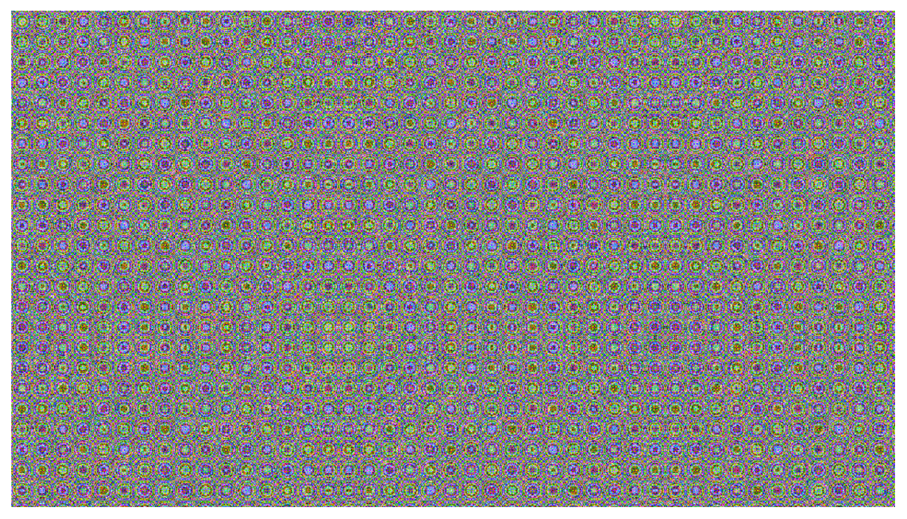

# WASM to Canvas with Clang - no Emscripten

This is a little project that shows an example of how to write some C code, compile with clang, load the wasm in javascript and then display an image created by the C code. It shows:

- How to compile into wasm from C
- How to export specific functions from C into Javascript
- How to mess with shard memory in Javascript
- An example of using `malloc` without the standard library
- Passing a buffer from Javascript to C
- Writing to a buffer in C and reading it in Javascript
- Taking a buffer and making an image
- Writing that image to a canvas
- Using requestAnimationFrame in javascript to repeatedly call into C

The code is quite heavily commented, and should, hopefully, be self explanatory. The start point is `src/graphics.c` and `public/test.html` and, of course, the `Makefile`.



## Running

_WARNING_ When running the app, the animation flashes a lot of colours rapidly. It may be seizure inducing I don't know. If you're prone to that kind of thing be cautious.

## Mac and Linux

You'll need `make` installed (Mac and Linux no problem see `brew` or `apt` or whatever). To compile you'll do:

```
make build
```

If you have python3 installed, you can run `make serve` and it'll build and run a web server for you to play with on http://localhost:8000

Then use your favorite mini http server and serve up the `public` directory (see `make start` for an example).

### Windows

On windows, you'll have to do something else, but you should be able to build with Visual Studio, install `clang` and port the `Makefile`.
